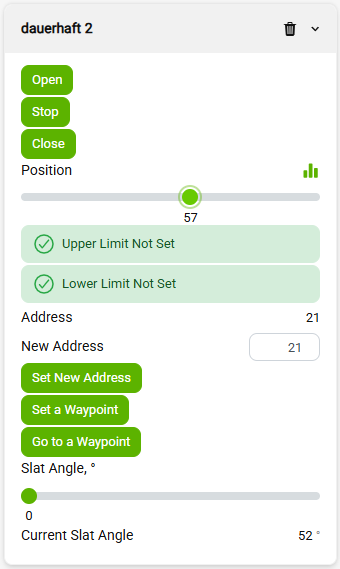
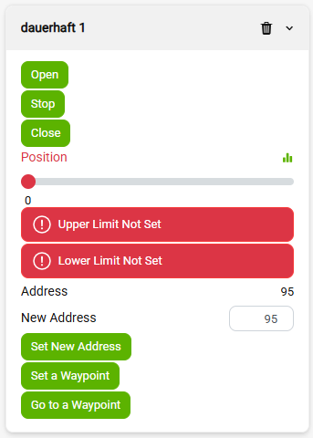

# wb-dauerhaft-pro

MQTT-драйвер Wiren Board для приводов штор и жалюзи **Dauerhaft PRO RS-485**.

Драйвер разработан на Python и использует [RPC wb-mqtt-serial](https://github.com/wirenboard/wb-mqtt-serial).

Приводы штор используют протокол «Профкарниз Dauerhaft PRO RS-485 v2.3».
Для каждого привода из конфигурации драйвер публикует в веб-интерфейсе
виртуальное устройство: движение и ползунок позиции, аварии незаданных пределов
хода, промежуточная точка, угол ламелей (для моделей с ламелями), смена адреса
на шине и индикация доступности.

## Состав

- `Jenkinsfile` — сборка на WB Jenkins (`buildDebArchAll`, пакет `arch: all`).
- `setup.py` + `wb/dauerhaft_pro/` — Python-пакет (неймспейс `wb.`, собирается через pybuild).
- `debian/` — метаданные пакета (`control`, `rules`, `changelog`, `install`, …).
- `configs/wb-dauerhaft-pro.schema.json` — схема для wb-mqtt-confed; создаёт
  страницу конфигурации в веб-интерфейсе.
- `configs/wb-dauerhaft-pro.conf` — конфигурация по умолчанию (пустой список приводов).
- `10wb-dauerhaft-pro` — файл wb-configs (`wb_move`): правки конфигурации
  переживают обновление прошивки и factory reset.

## Установка

`apt update && apt install wb-dauerhaft-pro`.

## Конфигурация

После установки в веб-интерфейсе контроллера появляется страница конфигурации
(**Настройки → Конфигурационные файлы → Dauerhaft PRO Driver**). 
Конфигурация хранится в
`/etc/wb-dauerhaft-pro.conf`.

В зависимости от настроек появится виртуальное устройство с настройками угла
ламелей или без них:

 

## Сервис

Сервис `wb-dauerhaft-pro` стартует автоматически после установки. По кнопке
«Записать» в редакторе конфигураций он перезапускается — правки сразу видны
в разделе «Устройства».

На каждый привод из конфигурации публикуется виртуальное устройство:

- **Открыть** / **Стоп** / **Закрыть** — движение;
- **Позиция** — ползунок 0…100 %: показывает текущее положение и задаёт целевое
  (привод едет в заданный процент и останавливается сам). Пока у привода не
  заданы пределы хода, положения у него нет: ползунок помечается ошибкой
  чтения, а команды позиции отклоняются с записью в журнал;
- **Верхний предел не задан** / **Нижний предел не задан** — аварии: 1, пока
  соответствующий предел хода у привода не задан;
- **Установить промежуточную точку** / **Перейти на промежуточную точку** —
  запомнить текущее положение и позже приехать в него;
- **Угол ламелей** (ползунок 0…180°) и **Текущий угол ламелей** (градусы) —
  только для приводов с ламелями (по режиму угла в конфигурации);
- **Адрес** (только чтение), поле **Новый адрес** и кнопка **Установить новый
  адрес** — смена адреса привода на шине.

Настройка **Реверс** в конфигурации меняет местами «Открыть»/«Закрыть» и
зеркалит позицию — и показ, и команду ползунка.

Сервис запускается без аргументов (`ExecStart=/usr/bin/wb-dauerhaft-pro`, всё
на значениях по умолчанию). Необязательные аргументы командной строки нужны для отладки и ручного запуска:

- `-c PATH` — путь к файлу конфигурации (по умолчанию `/etc/wb-dauerhaft-pro.conf`);
- `-b URL` — адрес брокера, напр. `-b tcp://host:1883` (по умолчанию — unix-сокет mosquitto);
- `-d` — отладочные сообщения без правки конфигурации.

Некорректная конфигурация завершает демона с кодом 6 (NOTCONFIGURED) и понятным сообщением в журнале — без цикла перезапусков; 
после исправления конфигурации сервис перезапускается кнопкой «Записать».
